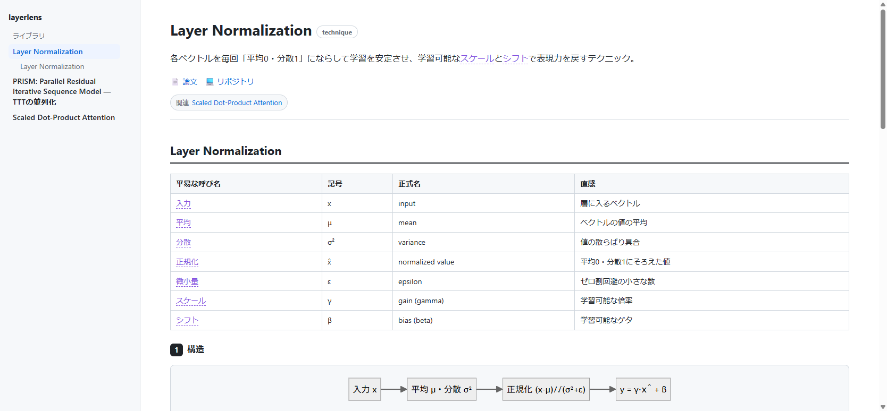

# layerlens

**Throw in a paper, a GitHub repo, or just the name of a technique — get back a
layer-by-layer explanation of a neural network, in five linked views.**



layerlens is an **MCP server + local renderer**. You connect it to an MCP host you
already use (Claude Desktop, Claude Code, Cursor, …). The host's model — driven by
**your own subscription** — does the explaining; layerlens gives it the methodology,
fetches the real sources, runs the code, and renders the result to a local web page.

> layerlens **never calls an LLM itself and never handles an API key.** The
> reasoning happens in your MCP host, on your existing plan. That is the whole
> point: no metered API, no shared credentials, no hosted service borrowing your
> subscription.

## The five views

Every component (a layer, block, or technique) is explained five ways, and the
views are **linked** by a shared *concept ledger* so the same idea keeps the same
everyday word, symbol, and formal name across all of them:

1. **構造** — a Mermaid diagram of the data flow, plus a short note.
2. **言葉での説明** — plain language only. No symbols, no jargon.
3. **数式** — the real notation, carrying over the everyday words from view 2 and
   attaching each to its symbol (hover any highlighted word to see the mapping).
4. **素の実装** — a from-scratch implementation that is *literally the math*
   (pure Python / numpy, no torch), **actually executed** so the output is real.
5. **最適化された実装** — the fast version, excerpted from the official repository
   (with a source link) or written from scratch when none exists — numerically
   cross-checked against the naive view when it's locally runnable.

Beyond a single page:

- **Library** — every explanation you generate is saved locally
  (`~/.layerlens/store`) and listed in the sidebar; delete with the hover ✕.
- **Cross-links** — explanations reference each other (`related` chips and
  `[[slug]]` wikilinks in the prose). Links to explanations you haven't generated
  yet show up greyed out — a built-in "what to explain next" list.
- **Contract lint** — `render` returns warnings when the views drift apart
  (a ledger term never marked, symbols leaking into the plain-words view, an
  uncited optimized view, an unverified naive run), so the host fixes them.
- **Self-healing pages** — pages are stamped with a template hash and rebuilt
  automatically when layerlens updates its renderer.

## Install

```bash
pip install layerlens        # or: pipx install layerlens
```

Or from source:

```bash
git clone https://github.com/<you>/layerlens
cd layerlens
pip install -e .
```

## Connect it to your MCP host

**Claude Desktop** — add to `claude_desktop_config.json`:

```json
{
  "mcpServers": {
    "layerlens": { "command": "layerlens" }
  }
}
```

**Claude Code**:

```bash
claude mcp add layerlens -- layerlens
```

(If the `layerlens` script isn't on your PATH, use
`"command": "python", "args": ["-m", "layerlens"]` instead.)

## Use it

In your host, invoke the `explain` prompt (e.g. type `/layerlens` / `/explain`) or
just ask:

> layerlens で Scaled Dot-Product Attention を説明して

The host will fetch the paper/repo, write the five views, run the naive code to
verify it, and hand you a URL like `http://127.0.0.1:8787/e/…` — open it for the
rendered page with diagrams, math, and hover-linked terms.

## Try the renderer without a host

```bash
python scripts/build_example.py     # (re)build the bundled example, runs its code
python scripts/demo_render.py --open
```

## How it fits together

```
MCP host (your subscription) ── drives ──► layerlens tools
        │                                    ├─ fetch_paper / find_official_repo / fetch_repo_code
        │  writes the 5 views                ├─ run_python   (proves view 4 runs)
        └───────────────────────────────────► render        (→ local web page URL)
```

- **Tools** = the deterministic work (retrieval, code execution, rendering).
- **`explain` prompt** = the methodology the host follows to assemble the views.

## Limitations (read before trusting it)

- **Correctness is not guaranteed.** The prose and math are written by the host
  model. Diagrams are model-generated and are the weakest link — treat view 1 as a
  sketch. View 4 is executed, so its output is real; the rest is best-effort.
- **`run_python` is not a hardened sandbox.** It runs code your host produced, on
  your machine, with a timeout — not untrusted third-party code. Don't point it at
  untrusted input.
- **View 5 excerpts** are fetched from public repos at view time and shown with
  attribution; nothing is redistributed. Respect each source repo's license.
- The renderer loads Markdown/Mermaid/KaTeX from a CDN, so viewing needs internet.

## License

MIT. See [LICENSE](LICENSE).
